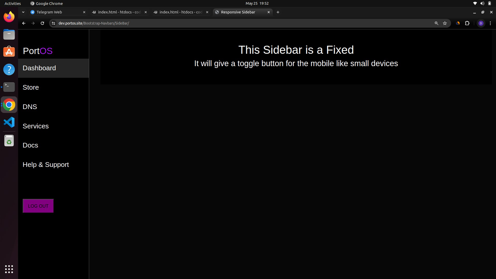
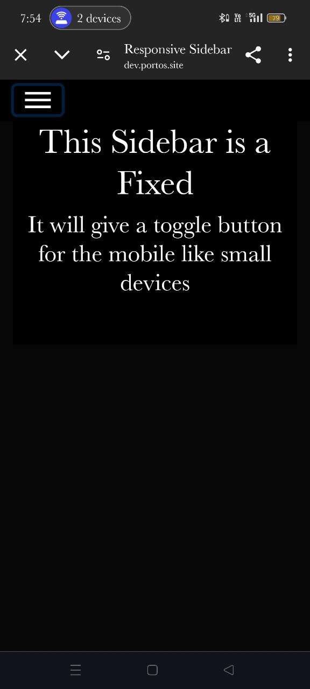
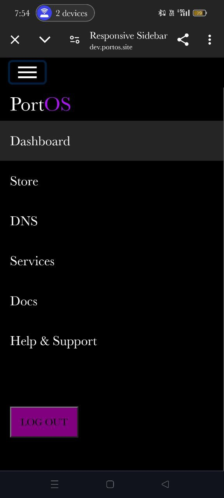

# Sidebar

This file contains the implementation of a Sidebar that is fixed on the left side of the page. The Sidebar includes the following features:

- **Fixed Sidebar:** The Sidebar remains fixed on the left side of the page, providing easy access to navigation links or other elements.
- **Responsive Design:** The Sidebar is designed to be responsive, ensuring it works seamlessly on both desktop and mobile devices.
- **Toggle Button:** For small devices like mobile phones, a toggle button is provided. When clicked, the Sidebar will open, providing access to the elements within.

## Examples

### Desktop View

### Mobile View

In the desktop view, the Sidebar remains visible on the left side of the page. In the mobile view, the Sidebar can be toggled open or closed using the toggle button.

